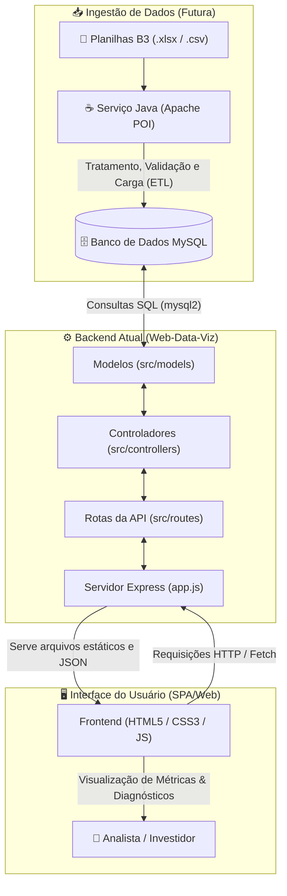

# FinSight 📈 | Inteligência Financeira

<p align="center">
  
</p>

<p align="center">
  <strong>Transformando planilhas brutas de renda variável em indicadores de risco, volatilidade e rentabilidade prontos para decisão.</strong>
</p>

<p align="center">
  
  
  
  
  
  
  
</p>

---

## 📖 Sumário

- [Sobre o Projeto](#-sobre-o-projeto)
- [Funcionalidades Principais](#-funcionalidades-principais)
- [Arquitetura e Fluxo de Dados](#-arquitetura-e-fluxo-de-dados)
- [Tecnologias Utilizadas](#-tecnologias-utilizadas)
- [Estrutura de Pastas](#-estrutura-de-pastas)
- [Como Configurar e Executar](#-como-configurar-e-executar)
  - [Pré-requisitos](#pré-requisitos)
  - [Passo a Passo](#passo-a-passo)
- [Integração Futura: Java & Apache POI](#-integração-futura-java--apache-poi)
- [Equipe de Desenvolvimento](#-equipe-de-desenvolvimento-grupo-10)
- [Licença](#-licença)

---

## 📌 Sobre o Projeto

O **FinSight** é uma solução desenvolvida pelo **Grupo 10** da faculdade **SPTech (São Paulo Tech School)** no curso de **Análise e Desenvolvimento de Sistemas**.

No mercado financeiro, investidores e analistas frequentemente se deparam com arquivos de cotações densos, fragmentados e em formatos brutos de planilhas da **B3**. A consolidação e o cálculo manual de indicadores consomem tempo excessivo e geram riscos operacionais.

O FinSight foi idealizado para eliminar essa complexidade:
- Automatizar o tratamento e cálculo de dados históricos de ativos;
- Gerar diagnósticos visuais e objetivos de volatilidade e retorno;
- Proporcionar uma interface web intuitiva e responsiva (com suporte a modo claro e escuro), acessível diretamente pelo navegador sem dependência de instalações pesadas.

---

## 🎯 Funcionalidades Principais

- [x] **Interface Institucional Completa:** Páginas de Início, Sobre Nós e Contato com alternância dinâmica entre tema claro e tema escuro.
- [x] **API Web Data Viz (Node.js + Express):** Estrutura padronizada de rotas, controladores e modelos para autenticação e consumo de dados.
- [x] **Persistência Relacional (MySQL):** Modelagem de banco de dados para empresas, usuários e métricas financeiras.
- [ ] **Ingestão Automatizada de Planilhas:** Leitura e processamento de arquivos `.xlsx` e `.csv` via módulo Java com Apache POI.
- [ ] **Dashboards Interativos:** Visualização gráfica de curvas de rentabilidade e matriz de volatilidade.
- [ ] **Rankings e Alertas de Risco:** Comparador de papéis com base em métricas calculadas.

---

## 🏗️ Arquitetura e Fluxo de Dados

O projeto combina uma aplicação web orientada a serviços (atualmente baseada na arquitetura **web-data-viz**) com um pipeline planejado de ingestão de dados em lote utilizando **Java + Apache POI**.



---

## 🛠️ Tecnologias Utilizadas

### Atual (Em Operação)
- **Node.js**: Ambiente de execução assíncrono para o backend.
- **Express.js**: Framework minimalista para criação de rotas e APIs RESTful.
- **MySQL2**: Driver de alta performance para conexão com o banco de dados MySQL Server.
- **Dotenv**: Gerenciamento de variáveis de ambiente sensíveis.
- **CORS**: Habilitação de Cross-Origin Resource Sharing.
- **HTML5 & CSS3 Moderno**: Design limpo com variáveis CSS e suporte a modo Dark/Light.
- **JavaScript (ES6+)**: Lógica clientside, manipulação de DOM e tema.

### Em Integração / Futuro
- **Java (OpenJDK 17+)**: Responsável pelo processamento assíncrono e batch de dados pesados.
- **Apache POI**: Biblioteca Java especializada na leitura, escrita e manipulação de arquivos de planilhas do Microsoft Excel (`.xlsx` e `.xls`).

---

## 📂 Estrutura de Pastas

```text
Grupo10/
├── public/                     # Arquivos estáticos servidos ao cliente
│   ├── assets/                 # Imagens, vídeos e ícones da aplicação
│   ├── css/                    # Folhas de estilo (tema claro/escuro, layout)
│   ├── html/                   # Páginas web da aplicação
│   │   ├── index.html          # Página inicial com apresentação do produto
│   │   ├── sobre.html          # Informações institucionais e membros da equipe
│   │   └── contato.html        # Canal de atendimento e contato
│   └── js/                     # Scripts de frontend (tema, validações)
│
├── src/                        # Código-fonte do servidor backend (Web Data Viz)
│   ├── controllers/            # Controladores com regras de negócio
│   ├── database/               # Conexão e scripts DDL/DML do MySQL
│   │   ├── config.js           # Gerenciador de conexão com o banco
│   │   └── script-tabelas.sql  # Script de criação de tabelas
│   ├── models/                 # Modelos com queries e comandos SQL
│   └── routes/                 # Definição das rotas e endpoints
│
├── .env                        # Variáveis de ambiente (Porta, Host, Credenciais do BD)
├── app.js                      # Ponto de entrada do servidor Node.js
├── package.json                # Gerenciador de dependências e scripts npm
└── README.md                   # Documentação do projeto
```

---

## 🚀 Como Configurar e Executar

### Pré-requisitos
- [Node.js](https://nodejs.org/) (versão 18 ou superior)
- [MySQL Server](https://www.mysql.com/) (versão 8.0+)
- Gerenciador de pacotes `npm` (incluso no Node.js)
- [Git](https://git-scm.com/)

### Passo a Passo

1. **Clonar o Repositório:**
   ```bash
   git clone https://github.com/TawanLander/Grupo10.git
   cd Grupo10
   ```

2. **Instalar Dependências:**
   ```bash
   npm install
   ```

3. **Configurar as Variáveis de Ambiente:**
   Abra o arquivo `.env` localizado na raiz do projeto e configure as credenciais do seu banco de dados local ou em nuvem:
   ```env
   AMBIENTE_PROCESSO=desenvolvimento

   # Credenciais do Banco de Dados
   DB_HOST=localhost
   DB_DATABASE=aquatech
   DB_USER=seu_usuario
   DB_PASSWORD=sua_senha
   DB_PORT=3306

   # Porta do Servidor Web
   APP_PORT=8080
   APP_HOST=localhost
   ```

4. **Preparar a Base de Dados:**
   Execute o script SQL disponível em `src/database/script-tabelas.sql` em seu cliente MySQL (Workbench, DBeaver ou terminal) para provisionar as tabelas necessárias.

5. **Iniciar a Aplicação:**
   - Modo padrão:
     ```bash
     npm start
     ```
   - Modo desenvolvimento com recarregamento automático (Nodemon):
     ```bash
     npm run dev
     ```

6. **Acessar a Plataforma:**
   Abra seu navegador e acesse:
   ```text
   http://localhost:8080/
   ```

---

## 🔮 Integração Futura: Java & Apache POI

Como parte do plano de evolução técnica do FinSight, será acoplado um **módulo complementar em Java**:

### Por que Apache POI?
A manipulação de planilhas extensas contendo milhares de linhas de cotações históricas da B3 exige alta performance e robustez na leitura de células tipadas, formatação de datas e tratamento de exceções. A biblioteca **Apache POI** é o padrão de mercado para manipulação de arquivos OOXML (`.xlsx`) e OLE2 (`.xls`) no ecossistema Java.

### Como funcionará o fluxo de integração?
1. **Upload / Recepção do Arquivo:** O usuário fornece a planilha bruta de ativos da B3.
2. **Processamento via Java (Apache POI):**
   - Extração estruturada de colunas essenciais: código do ativo (ticker), data do pregão, valor de abertura, fechamento, máxima, mínima, volume e oscilação.
   - Validação de integridade e consistência dos registros.
3. **Persistência Direta no MySQL:**
   - O serviço Java realiza operações em lote (*batch inserts*) conectando-se ao mesmo banco de dados relacional.
4. **Disponibilização na Web Data Viz:**
   - A API Node.js/Express consulta as métricas já tratadas e alimenta os componentes visuais do FinSight em tempo real.

---

## 👥 Equipe de Desenvolvimento (Grupo 10)

Alunos do curso de **Análise e Desenvolvimento de Sistemas** da **SPTech - São Paulo Tech School**:

| Integrante | Função |
| :--- | :--- |
| **Gabriel Filgueiras** | Desenvolvedor / Integrante do Grupo |
| **Gabriel Fonseca** | Desenvolvedor / Integrante do Grupo |
| **Leonardo Moura** | Desenvolvedor / Integrante do Grupo |
| **Nicoly Baptista** | Desenvolvedora / Integrante do Grupo |
| **Paola Veloso** | Desenvolvedora / Integrante do Grupo |
| **Tawan Lander** | Desenvolvedor / Integrante do Grupo |

---

## 📄 Licença

Este projeto é desenvolvido para fins acadêmicos sob a licença [MIT](LICENSE).
Instituição: **São Paulo Tech School - SPTech**.